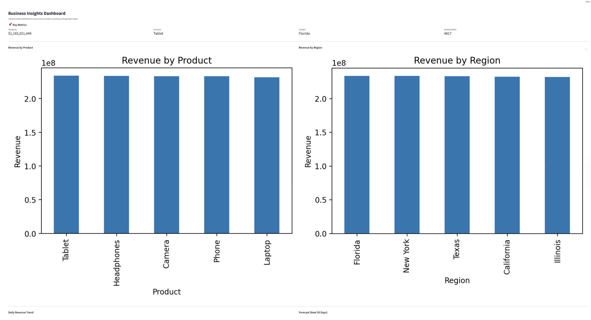
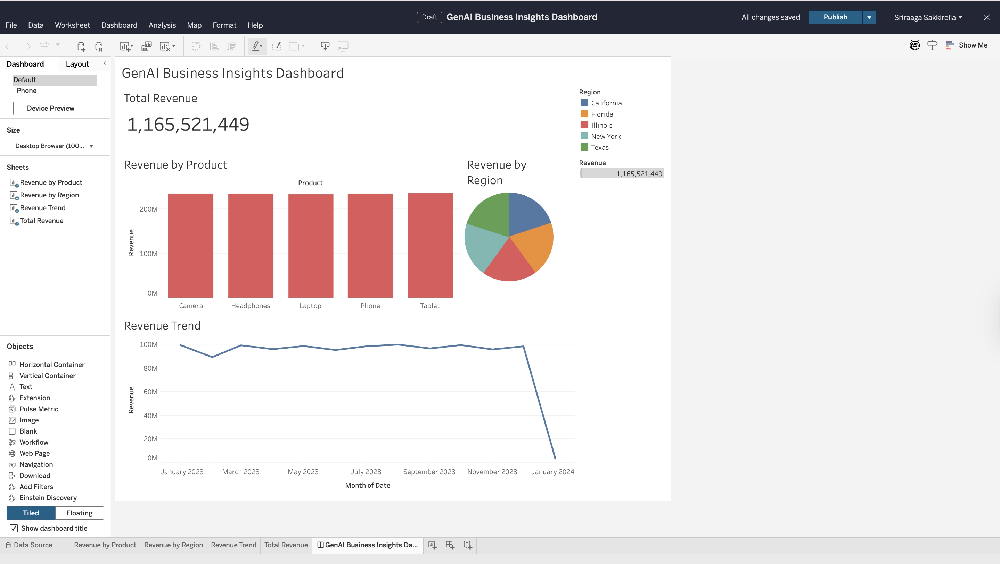
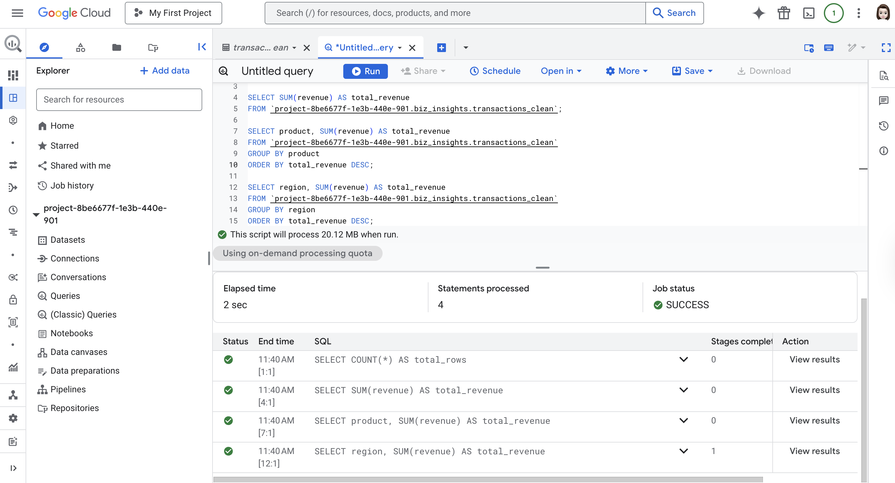

# GenAI Business Insights and Demand Forecasting

## Overview
End-to-end data engineering and analytics project that processes 500,000+ transactions to generate business insights, detect anomalies, and forecast demand using ETL pipelines, BigQuery, Python, and Generative AI.

---

## Tech Stack
- Python (Pandas, Streamlit)
- SQL (BigQuery)
- ETL Pipelines (Data Cleaning, Transformation)
- GCP BigQuery (Data Warehouse)
- Generative AI (GPT for Insight Generation)
- Tableau (Data Visualization)

---

## Key Features
- Built ETL pipelines to clean, transform, and load 500K+ transactions
- Performed SQL-based analysis using BigQuery
- Developed interactive dashboard using Streamlit
- Created Tableau dashboards for business reporting
- Detected anomalies in transaction data
- Forecasted revenue for next 30 days
- Generated AI-powered business insights using GPT

---

## Streamlit Dashboard


---

## Tableau Dashboard


---

## BigQuery SQL Analysis


---

## How to Run
```bash
pip install -r requirements.txt
streamlit run dashboard/app.py